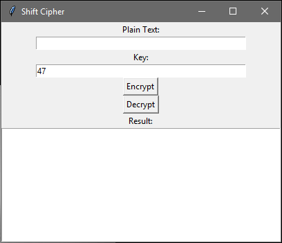
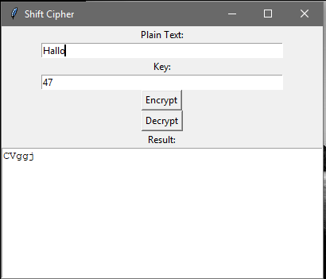
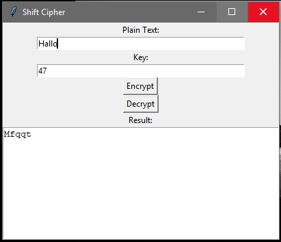

## Aplikasi Shift Cipher

Kode program ini, membuat sebuah jendela GUI yang memiliki input plain text, input key, dan tombol untuk mengenkripsi dan mendekripsi.



Setelah tombol ditekan, hasil akan ditampilkan di bawah tombol. 

Setelah mengisi plain text, key dan menekan tombol encrypt makan akan muncul hasil sebagai berikut :



Apabila menekan tombol decrypt makan akan muncul hasil sebagai berikut :



Kode ini menggunakan library Tkinter untuk membuat tampilan GUI dan mengintegrasikan fungsi enkripsi dan dekripsi Shift Cipher dengan kunci shift 47. Apabila ingin mengubah nilai kunci shift dapat mengubah dengan mengedit nilai pada ``` self.key_text.insert(0, '47') ```. Tidak hanya itu bisa juga mengubah tampilan GUI dengan mengedit properti seperti warna, ukuran, dan posisi widget yang digunakan.
