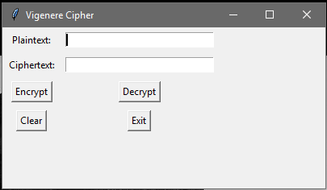
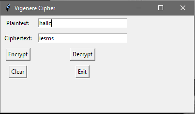
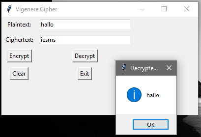

## Aplikasi Vigenere Chiper

Kode program ini, membuat sebuah jendela GUI yang memiliki input plain text, chipertext, tombol untuk mengenkripsi, mendekripsi, tombol clear dan tombol exit.

Setelah tombol ditekan, hasil akan ditampilkan di bawah tombol. 

Setelah mengisi plain text dan menekan tombol encrypt makan akan muncul hasil sebagai berikut :

Apabila menekan tombol decrypt makan akan muncul hasil sebagai berikut :

Kode ini menggunakan library Tkinter untuk membuat tampilan GUI dan mengintegrasikan fungsi enkripsi dan dekripsi Vigenere Chiper dengan kunci shift 147.
